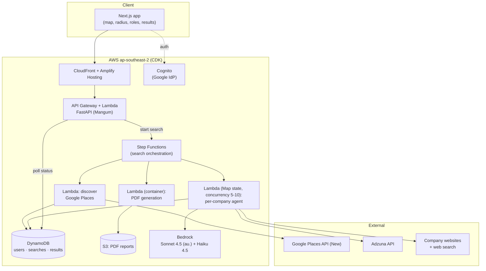

# Find-Me-A-Job AI — Project Plan (V1 PoC)

**Stack:** Next.js frontend · Python (FastAPI) backend · AWS (CDK) · Amazon Bedrock
**Market:** Australia · **Billing:** none in V1 (1 free search enforced, no payments)
**Date:** 2026-07-28

---

## 1. Concept

User picks a location + radius + job role(s). The app finds nearby businesses via Google Places, then an LLM agent investigates each company (careers page → job boards → contact email) and returns a ranked list of opportunities, downloadable as PDF.

## 2. Critical research findings (these change the original spec)

1. **Seek has no public job-search API.** [developer.seek.com](https://developer.seek.com/) is for employers (posting jobs), not searching listings. Scraping Seek directly violates their ToS. **Replacement:** [Adzuna API](https://developer.adzuna.com) (official, covers AU, ~1,000 free calls/month) + site-restricted web search (`site:seek.com.au "<company>" jobs`) via a search API.
2. **LinkedIn has no public jobs API** either. Same fallback: site-restricted search, links only.
3. **Google Places pricing is field-driven.** Nearby Search (New) bills by the most expensive field requested: Pro tier (~$32/1K requests, 5K free/mo) covers name/address/location/types; requesting `websiteUri` or phone bumps to Enterprise (~$35/1K, only 1K free/mo). Nearby Search returns **max 20 results per request** (no pagination); Text Search paginates to 60. Plan: Nearby/Text Search with tight field masks; batch Place Details only for shortlisted companies.
4. **Places ToS:** place data can't be stored long-term (place IDs are the exception). Cache results per-search only; don't build a persistent company database from Places data in V1.
5. **Bedrock in Sydney (ap-southeast-2):** in-region on-demand is limited to older Claude 3 models. Use **cross-region inference profiles pinned to the AU geo boundary**: Claude Sonnet 4.5 (`au.` profile) for agent orchestration, Claude Haiku 4.5 for cheap page classification/extraction.
6. **Known product risk:** Places works well for storefront jobs (hospitality, retail, trades) but poorly for office roles (IT) — software companies often aren't well represented as map places. V1 should market itself toward hospitality/retail/trades; treat IT as best-effort.

## 3. Architecture



**Key decision — async pipeline.** A search investigates 20–60 companies; at ~10–30 s per company even with concurrency it takes 1–5 minutes. Never do this in a request/response cycle:

1. `POST /searches` → validates quota, writes search record, starts a Step Functions execution, returns `search_id` immediately.
2. Step Functions: **Discover** (Places query, dedupe, filter by role→place-type mapping) → **Map state** running the per-company agent Lambda with bounded concurrency → **Aggregate** → optional **PDF**.
3. Frontend polls `GET /searches/{id}` (results stream in incrementally — show companies as they complete, this makes the wait feel fine).

**Why not Bedrock Agents (the managed service):** a hand-rolled tool-use loop via the Converse API in Python gives full control over budgets, retries, and prompt iteration, with less vendor lock-in and easier local testing. Bedrock is still the inference layer.

### Components

| Piece | Choice | Notes |
|---|---|---|
| Frontend | Next.js 15, deployed on Amplify Hosting | Map: Google Maps JS SDK (circle radius picker) or MapLibre + free tiles to cut cost |
| API | FastAPI on Lambda via Mangum, API Gateway HTTP API | Sync endpoints only (start search, poll, profile) |
| Auth | Cognito user pool with Google as federated IdP | Meets "Google login" without custom auth; JWT to API Gateway authorizer |
| Orchestration | Step Functions Standard + Lambda | Map state gives retry/concurrency per company for free |
| Agent runtime | Python Lambda, 2–5 min timeout | httpx + BeautifulSoup/trafilatura for fetching/extraction |
| Inference | Bedrock Converse API; Sonnet 4.5 (au. profile) orchestrates, Haiku 4.5 for extraction/classification | Structured output via tool schemas |
| Data | DynamoDB single-table: `USER#`, `SEARCH#`, `RESULT#` items | Free-search quota = attribute on user item, checked transactionally |
| PDF | Lambda container image with WeasyPrint (HTML→PDF) | Render the same results view; presigned S3 URL, 7-day expiry |
| IaC | AWS CDK (Python), stage-suffixed stacks | Two environments: **test** and **prod** in account 418862088910, fully isolated resources |
| Observability | CloudWatch + structured logs; log every LLM call with token counts | Cost-per-search dashboard from day one |

### Environments & deployment identities

- **Two environments, one AWS account (418862088910):** CDK `Stage` constructs produce `Fmaj-Test-*` and `Fmaj-Prod-*` stacks with per-stage config (search caps, log retention) and fully separate DynamoDB tables, S3 buckets, Cognito pools, and state machines.
- **AWS deploys** assume `arn:aws:iam::418862088910:role/find-me-a-job-ai_role` (admin) — locally via a CLI profile with `role_arn`, in CI via GitHub Actions OIDC federation (no stored keys). Merge to main → deploy test; manual approval → prod.
- **GCP resources as code** via service account `iac-find-me-a-job-ai@project-7187e8cf-43d5-451b-be4.iam.gserviceaccount.com`: one OAuth client (for Cognito Google login) and one restricted Places API key per environment. The SA has IAM OAuth Client Admin + Service Usage Admin + API Keys Admin (all granted), and the OAuth consent screen is already configured — GCP side is ready for IaC.

## 4. The per-company agent

Input: company name, address, place types, `websiteUri` (if any), target roles.
Output (strict JSON): `{opportunity_type: careers_page | job_listing | contact_email | none, links[], emails[], evidence, confidence}`.

Tool loop (Sonnet 4.5 decides sequence, hard caps enforced in code):

- `fetch_url(url)` — fetch + readability-extract, truncated. Respects robots.txt, 10 s timeout.
- `find_careers_link(url)` — fetch homepage, return candidate nav/footer links matching careers/jobs/join-us patterns (cheap heuristic before LLM).
- `search_jobs_adzuna(company, role, location)` — official API.
- `web_search(query)` — SerpAPI or Tavily; used for `site:seek.com.au` / `site:linkedin.com/jobs` company lookups and finding websites Places missed.
- `extract_emails(url)` — contact/about page scrape, mailto + regex, prefer careers@/jobs@/hr@.

**Budgets (essential for cost + latency):** max 8 tool calls and ~60 s per company; Haiku pre-filter step decides whether a company is even plausible for the requested role before Sonnet spends tokens on it. On failure → `opportunity_type: none`, never retry-loop.

**Scraping ethics/legal:** respect robots.txt, identify with honest User-Agent, fetch only a handful of pages per site, never bypass logins/captchas. No Seek/LinkedIn page scraping — links only via search.

## 5. Cost model (per search, ~30 companies, rough)

| Item | Est. |
|---|---|
| Places: 3–6 Nearby/Text Search (Pro fields) + Details (Enterprise fields) for ~30 shortlisted | US$0.15–0.40 |
| Bedrock: 30 × (Haiku triage + ~4–6 Sonnet turns) ≈ 300–600K tokens mixed | US$0.40–1.20 |
| Web search API (~30–60 queries) | US$0.15–0.30 |
| Lambda/SFN/DDB/S3 | <US$0.05 |
| **Total per search** | **≈ US$0.75–2.00** |

Implication for V2 pricing: "unlimited searches" is dangerous at ~A$1–3/search cost. Prefer a monthly quota (e.g., 30 searches/mo) even if marketed as generous. Free-search cost (~A$2) is acceptable CAC. Verify against your own dashboard once live.

Note: AWS's new-account offer (US$100 credit at signup + up to US$100 for onboarding tasks, 6-month free plan) plus the per-SKU Google Places free calls can absorb most PoC costs — Bedrock has no perpetual free tier but burns those credits.

## 6. Role → Places mapping

Maintain a small curated dict, e.g. chef/kitchen hand → `restaurant, cafe, bakery, bar, meal_takeaway`; retail → `clothing_store, supermarket, ...`; construction → `general_contractor, electrician, plumber, roofing_contractor`; unknown roles → Text Search (New) with the role keyword + location bias. This mapping is a product asset — start with 10–15 common AU roles.

## 7. Delivery roadmap (solo dev, ~8–10 weeks part-time)

**Phase 0 — Foundations (wk 1):** monorepo (`web/` Next.js, `api/` FastAPI, `infra/` CDK), CI, dev/prod stacks, Cognito+Google login end-to-end, API keys (Google, Adzuna, search API) in Secrets Manager.

**Phase 1 — Search input UX (wk 2):** map with address autocomplete + draggable radius circle (1/5/10 km), role selector, `POST /searches` stub writing to DynamoDB, quota check (free search flag).

**Phase 2 — Company discovery (wk 3):** Places integration with field masks, role→type mapping, dedupe (place_id), radius filter, cap at ~40 companies. Test harness: run discovery for 5 suburbs × 3 roles, eyeball quality.

**Phase 3 — Agent pipeline (wk 4–6, the core):** tools + Converse loop, budgets, structured output; Step Functions Map wiring; incremental result writes. Build a small eval set (20 hand-checked companies) and measure precision — this is the make-or-break phase; timebox prompt iteration.

**Phase 4 — Results + PDF (wk 7):** results page with live progress, grouping by opportunity type, empty-state message; WeasyPrint report; presigned download.

**Phase 5 — Hardening + beta (wk 8+):** rate limiting, error states, cost dashboard, ToS/privacy pages, 5–10 real users in one suburb (hospitality roles), iterate on agent precision.

**Explicitly out of V1:** payments, saved searches/alerts, resume/cover-letter generation (V2), multi-region, mobile app.

## 8. Top risks

1. **Result quality** — if the agent surfaces mostly "none" or stale links, the product fails. Mitigate: eval set in Phase 3, launch narrow (hospitality in one city).
2. **Office-role coverage** (IT etc.) — Places blind spot. Mitigate: position V1 for local/storefront work.
3. **Cost per search creep** — mitigate: hard budgets, Haiku triage, per-search cost logging, company cap.
4. **ToS exposure** — no Seek/LinkedIn scraping; Places data not persisted beyond the search; robots.txt respected.
5. **Latency UX** — mitigate: streaming results as they arrive, clear progress indicator.

## 9. Suggested repo layout

```
find-me-a-job-ai/
├── web/            # Next.js (Amplify Hosting)
├── api/            # FastAPI (Lambda + Mangum)
├── agent/          # per-company agent Lambda: tools/, prompts/, evals/
├── infra/          # AWS CDK (Python): auth, api, pipeline, data stacks
└── docs/           # this plan, ADRs
```

---

### Sources

- [Google Maps Platform pricing](https://developers.google.com/maps/billing-and-pricing/pricing) · [free-tier change (per-SKU free calls)](https://mapsplatform.google.com/resources/blog/start-building-today-with-up-to-10-000-monthly-free-calls-per-product/) · [Places pricing breakdown](https://www.woosmap.com/blog/google-places-api-pricing)
- [SEEK Developer (employer-only API)](https://developer.seek.com/)
- [Adzuna API](https://developer.adzuna.com) · [Adzuna API field guide](https://jobspipe.dev/blog/adzuna-api)
- [Bedrock AU cross-region inference profiles (Sonnet/Haiku 4.5)](https://aws.amazon.com/blogs/machine-learning/introducing-amazon-bedrock-cross-region-inference-for-claude-sonnet-4-5-and-haiku-4-5-in-japan-and-australia/) · [Bedrock model availability ap-southeast-2](https://modelavailability.com/platforms/aws/regions/ap-southeast-2)
- [AWS Free Tier: credits + 6-month free plan](https://aws.amazon.com/about-aws/whats-new/2025/07/aws-free-tier-credits-month-free-plan/)
